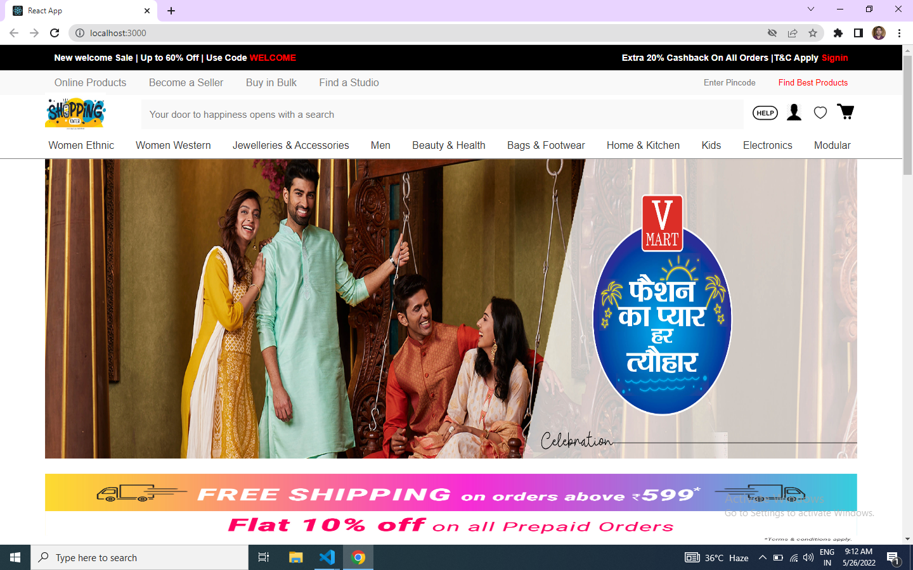
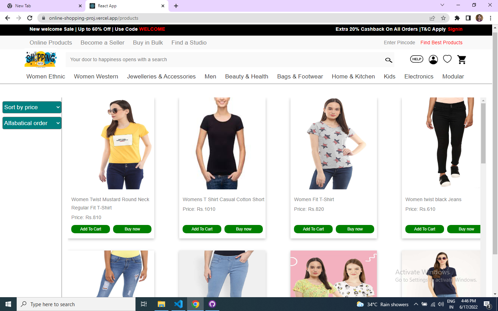
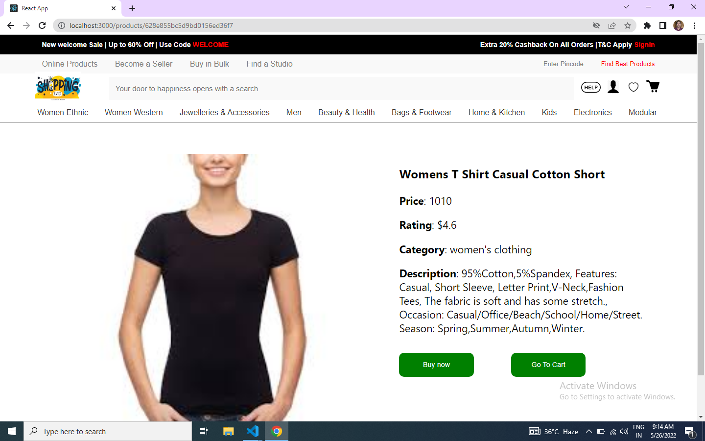
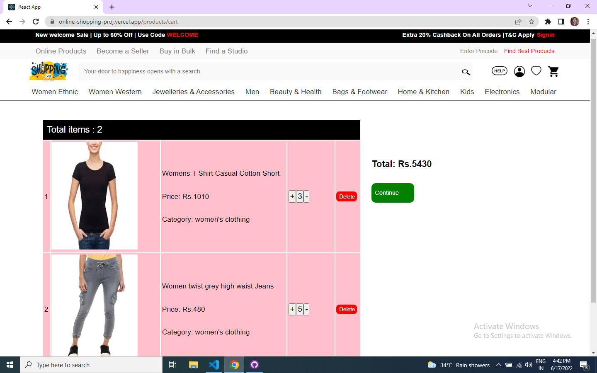

# E-commerce website

---

## This is an E-commerce projects. I used MERN stack to build this project. And this is a fully responsive for all screen size.

Backend repo link of this project : https://github.com/gulashanhashami/projectBackendCode.git

# Prerequisities

- React.js
- HTML
- JavaScipt
- CSS 
- Styled-components
- Redux

# Run Locally

- To run this project locally follow following steps below
- Create folder in your local system

Clone this Project

`git pull https://github.com/gulashanhashami/gulashan-fw13_394.git`

- Now the project is ready just go and visit home page

Live demo : https://online-shopping-proj.vercel.app/

# Screenshots

> HOME PAGE

> SIGN-UP PAGE

> LOGIN PAGE

> PRODUCT PAGE

> PRODUCT DETAILS PAGE

> CART PAGE

> ADDRESS PAGE

> PAYMENT PAGE

# What did I Learn

- By end of this project, I am able to learn how effective work can be done when ideas are trajected in multiple spectrums.

- Effective learning involves how I was able to debug before we present our project.

